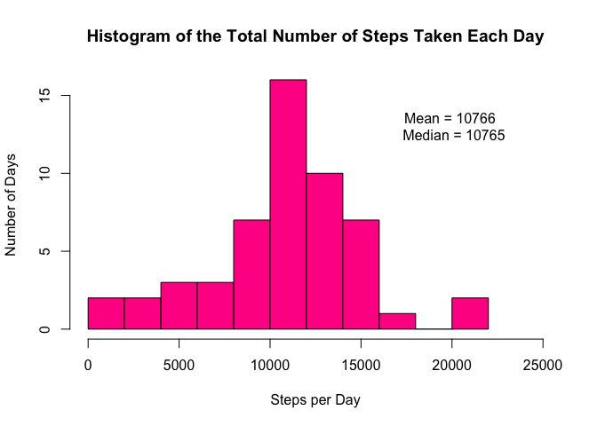
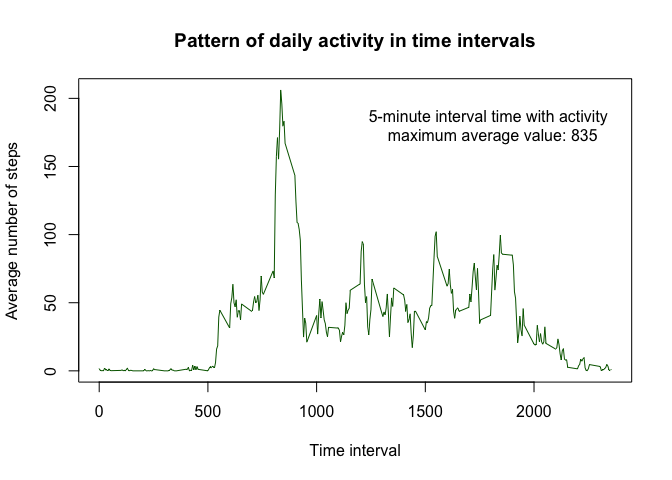
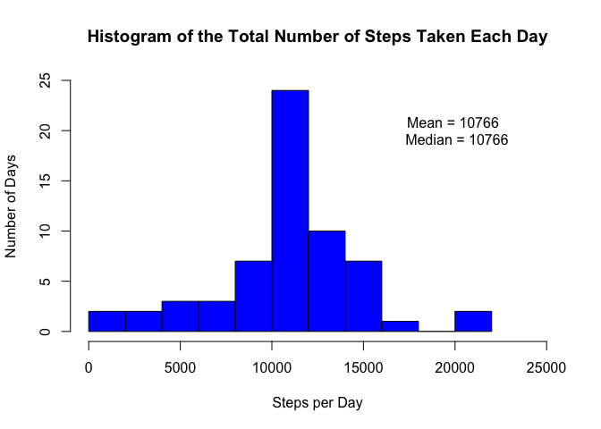
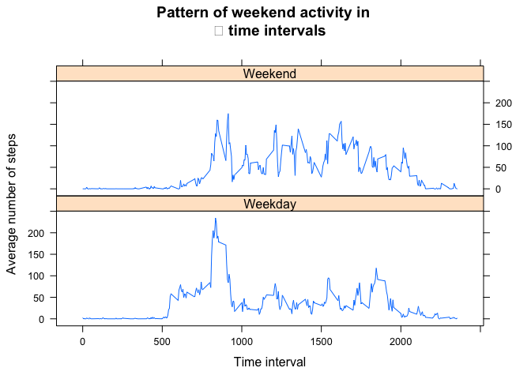

# Reproducible Research: Peer Assessment 1


This is the project requirement for passing the second week of "Reproducible Research" class from coursera.

## Loading and preprocessing the data

The data was downloaded from the [link](https://d396qusza40orc.cloudfront.net/repdata%2Fdata%2Factivity.zip) given in the activity instructions on May 11th, 2016. 

So, lets start importing the database in csv format and changing the date form character to Date type variable.  


```r
setwd("~/Documents/DataScienceCoursera/5Reproducible Research")
activity<-read.csv("activity.csv", as.is = TRUE)
activity$date <- as.Date(activity$date, "%Y-%m-%d")
```


## What is mean total number of steps taken per day?

Now, lets summarize the number of steps taken per day, ploting an histogram with total mean and median number of steps taken every day


```r
days <- aggregate(activity[,1], by=list(activity$date), sum)
mn <- mean(days$x, na.rm=T)
md <- median(days$x, na.rm=T)
hist(days$x, breaks=c(10), col="deeppink", 
     main = "Histogram of the Total Number of Steps Taken Each Day", 
     xlab= "Steps per Day", ylab = "Number of Days", xlim = c(0, 25000))
text(20000, 13, paste("Mean =", round(mn, 0), "\n Median =",  round(md, 0)))
```

<!-- -->


## What is the average daily activity pattern?


To evaluate the daily patter of movements, lets summarize the data by the time interval on the day it was observed

```r
intv <- aggregate(activity[,1], by=list(activity$interval), mean, na.rm=T)
interval_time <- intv$Group.1[which.max(intv$x)]
plot(intv$Group.1,intv$x, type="l", col="darkgreen", 
     main= "Pattern of daily activity in time intervals", 
     ylab= "Average number of steps", xlab= "Time interval")
text(1800,180, paste("5-minute interval time with activity",
                     "\n maximum average value:", interval_time) )
```

<!-- -->


## Imputing missing values
Now, lets evaluate the missing value influence in this work. For that, we will fill all NA values with the 5-minute interval average. 


```r
nacount <- sum(is.na(activity))
paste("The number of missing values in this data frame is", nacount)
```

```
## [1] "The number of missing values in this data frame is 2304"
```

```r
activityfill <- activity
for (i in 1:length(activityfill$steps)){
 if (is.na(activityfill$steps[i])){
   activityfill$steps[i]<-intv$x[which(intv$Group.1==activityfill$interval[i])]
 }
}
days2 <- aggregate(activityfill[,1], by=list(activityfill$date), sum)
mn2 <- mean(days2$x)
md2 <- median(days2$x)
hist(days2$x, breaks=c(10), col="blue", 
     main = "Histogram of the Total Number of Steps Taken Each Day", 
     xlab= "Steps per Day", ylab = "Number of Days", xlim = c(0, 25000), 
     ylim=c(0,25))
text(20000, 20, paste("Mean =", round(mn2, 0), "\n Median =",  round(md2, 0)))
```

<!-- -->

As we had used na.rm in the previous steps to calculate median and mean (the only way it would handle the data), the main influence of inputation is it raises the frequencies on the class which contains the means (this is due to, obviously, my choice of imputation - with the mean). It also changes sligthly the median, due to insertion of more central data. 


## Are there differences in activity patterns between weekdays and weekends?

Now, lets see if the activity patterns are different in weekends and weekdays. 


```r
activity2 <- activity
activity2$weekdays <- weekdays(activity2$date)
activity2$wknds[activity2$weekdays=="Saturday"|activity2$weekdays=="Sunday"]<-"Weekend"
activity2$wknds[activity2$weekdays!="Saturday"&activity2$weekdays!="Sunday"]<-"Weekday"

intv2 <- aggregate(activity2[,1],
                   by=list(activity2$interval, activity2$wknds), 
                   mean, na.rm=T)
library(lattice)
xyplot(x~Group.1|Group.2, data=intv2, 
  	 type= "l", layout=c(1,2), main= "Pattern of weekend activity in 
  	 time intervals", ylab= "Average number of steps", xlab= "Time interval")
```

<!-- -->

Seems like the activity pattern differs from weekdays to weekends.

